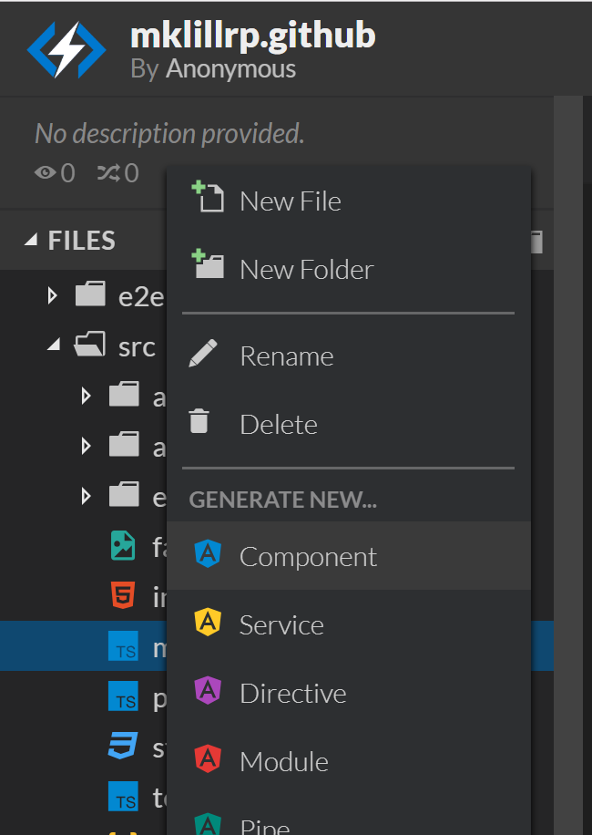

# A new component

In this chapter, we will write a whole new component. It will allow us to add an item to the todo list. It will be composed of the HTML elements `input` and `button`.

We'll use the Angular CLI to generate all the needed files and boilerplate for us. Stackblitz makes it easier. Go to the app folder and then select by right clicking the component option:



Name the component `input` and also make sure it has an inline-template.

> You can avoid manually configuring inline template by setting inline templates as a default in the configuration file `.angular-cli.json`.

> Don't worry about the component name `input`. It will not replace HTML's `input` element. That's thanks to the prefix that the Angular CLI gives to our components. The default prefix is `app`, so the component selector would be `app-input`. If you've created the project stating the prefix of your choice, or changed it afterwards in the file `.angular-cli.json`, this will be the prefix of the selector. When we created the project, we set the prefix to "todo", so the selector should be `todo-input`.

Let's take a look at what the Angular CLI created for us.

It created a new folder called `src/app/input`. There are three files there:

* `input.component.css` - this is where the style that's specific to the component will be placed.
* `input.component.spec.ts` - this is a file for testing the component. We will not deal with it in this tutorial.
* `input.component.ts` - this is the component file where we will define its template and logic.

Open the file `input.component.ts`. You can see that the Angular CLI has generated a default template for us:

```ts
  template: `
    <p>
      input Works!
    </p>
  `,
```

It has also added the selector according to the name we gave to the component, with the prefix we configured:

```ts
selector: 'todo-input',
```

We can use this component as-is and see the result!

Open the root component file `app.component.ts` and add the `todo-input` tag inside the template:

```ts
template: `
  <h1>
    Welcome to {{title}}!
  </h1>

  <todo-input></todo-input>
`,
```

Check what's new in the browser!

Get back to our `input.component.ts` and add some content. First, add a `title` member which we will use as the todo item title:

```ts
export class InputComponent implements OnInit {
  title: string = '';
  ...
```

It will not interfere with the `todo-root` component's `title`, since each component's content is encapsulated within it.

You can give an initial string to the title, like we did in the `todo-root` component.

Next, replace the default template with an input element, a button, and a binding to the title:

```ts
template: `
  <input>
  <button>Save</button>
  <p>The title is: {{ title }}</p>
`,
```

Check out the result!

This component doesn't do much at this point. In the following chapters, we will learn about the component class, and then implement the component's logic.

[See the results on StackBlitz](https://stackblitz.com/github/angularbootcamp/todo-list-tutorial-steps/tree/step-04_A_new_component)
