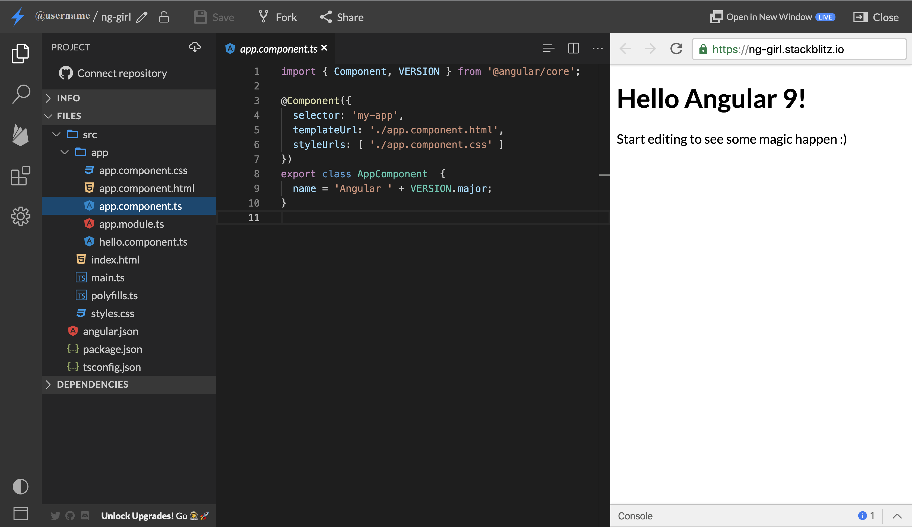

# \#1: ⌛ Installations

Every developer needs a set of tools and libraries to start working. In our case, we'll use the online editor [StackBlitz](https://stackblitz.com/).

To get your development environment going, follow these steps:

1. Register for a free account on [GitHub](https://github.com/).
2. StackBlitz uses your GitHub account as a social login. Register for a free [StackBlitz](https://stackblitz.com) account by using your GitHub account.
3. On StackBlitz's site, click **START A NEW APP** then select **Angular** to start a new Angular workspace. 

You should see a page similar this:

StackBlitz is an online editor that provides all the functionality of an online **IDE** by bundling **Visual Studio Code**, the **Angular CLI**, and a preview mode of your application together.

We want to use the starter application for ngGirls. Open the [ngGirls tutorial starter application](https://stackblitz.com/github/ng-girls/todo-list-tutorial/tree/master/examples/01-installations) and click the **Fork** button on the toolbar. This is your own copy of the starter application to use for the tutorial. You can now close any other StackBlitz tabs in your browser.

## Using StackBlitz for the tutorial

Most of the steps in this tutorial are the same for local development and online development, but if there's a difference, we'll draw attention to your online editor instructions. You'll see an info panel labeled  **StackBlitz Instructions**.

**You do not have a terminal to run Angular CLI commands**. StackBlitz supports Angular CLI commands in the user interface. Whenever you see instructions to type a command in the terminal, you will see a StackBlitz instruction info panel to walk you through that command.

## Congratulations!

You have a running Angular application and are all ready to start developing!

